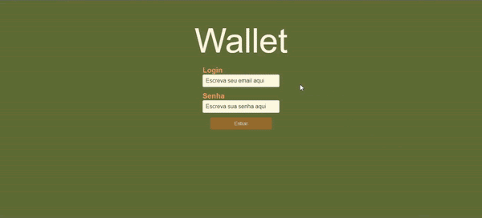

# Projeto Wallet

Neste projeto você vai desenvolver uma carteira de controle de gastos com conversor de moedas, ao utilizar essa aplicação um usuário deverá ser capaz de:

- Adicionar, remover e editar um gasto;
- Visualizar uma tabelas com seus gastos;
- Visualizar o total de gastos convertidos para - uma moeda de escolha;

[Testar Projeto](https://jonathankarlinski.github.io/wallet/)

## Conhecimentos Utilizados

- HTML
- CSS
- Java Script
- React.js
- Redux

## Demonstração

## Feedback

Se você tiver algum feedback, posso ser encontrado em

  
  
